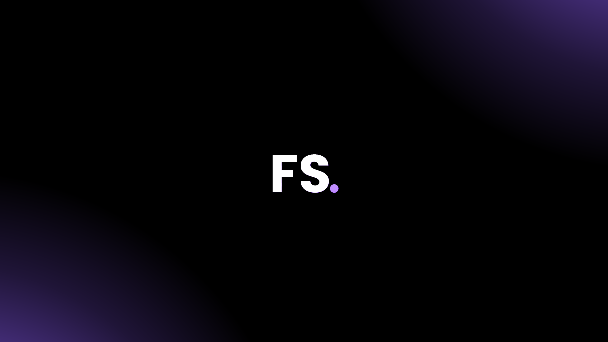

# Filipe Santiago — Software Engineer

---

## 🧭 Overview

I am a results-driven software engineer passionate about building clean, scalable, and user-focused digital experiences. This portfolio highlights a curated selection of projects that reflect my expertise in modern web development, clean architecture, and performance optimization.

---

## 🛠 Tech Stack

---

## Key Highlights

-  **Performance-First Development**: Optimized codebases for speed, scalability, and minimal footprint.
-  **Responsive Design**: Mobile-first interfaces with consistent cross-device experience.
-  **Component-Based Architecture**: Clean and reusable components powered by React + TypeScript.
-  **Type Safety at Scale**: Robust type systems using TypeScript for maintainable code.
-  **Modular CSS**: Isolated styling for predictable UI behavior and easier maintenance.
-  **Cross-Browser Compatibility**: Ensuring consistent experience across all major browsers.

---

## 📂 Portfolio Structure
- **Hero** – Quick intro with name, title, and tagline.
- **About** – Who I am, what I do, and my dev mindset.
- **Skills** – Technologies and tools I work with.
- **Projects** – Highlighted projects and what they solve.
- **Contact** – How to reach out and connect.

---

## Author

    <a href="https://github.com/SantiaGhou">
        
        
<strong>Filipe Santiago</strong>

    </a>

---

## ⚖️ License

This project is licensed under the [MIT License](LICENSE).

---

> *Crafted with precision and passion by Filipe Santiago*
